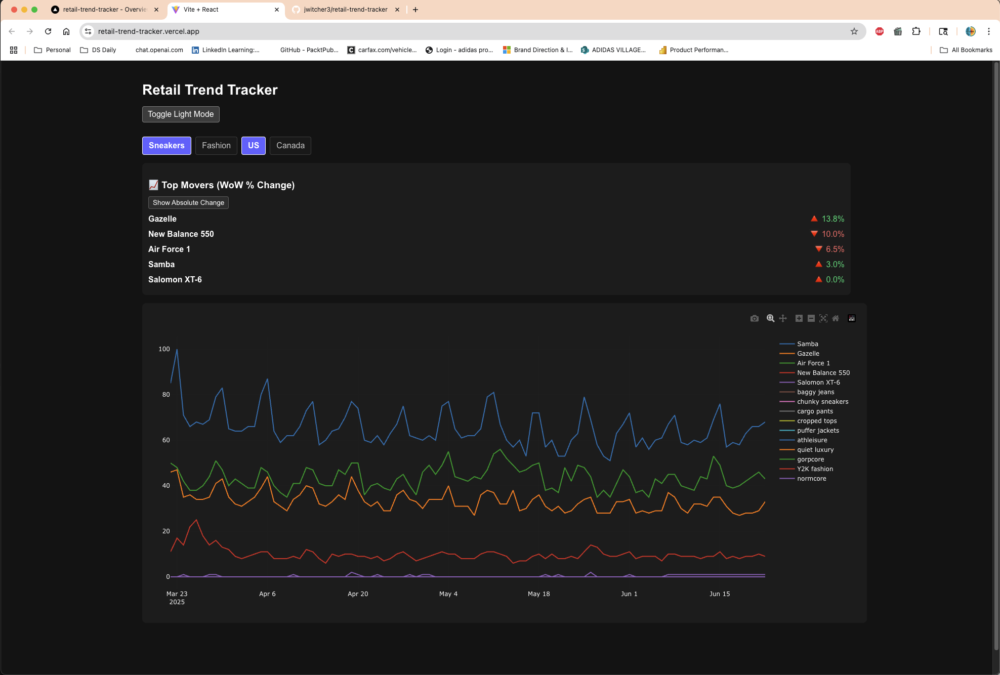

# Retail Trend Tracker 📈

A lightweight, interactive dashboard to visualize Google Trends data across sneaker and fashion segments. Built using React, Vite, and Plotly.js.

## 🔍 Features
- Toggle between Sneaker / Fashion and US / Canada data
- Light/Dark mode
- Top movers panel with arrows + % or Δ change toggle
- Interactive time series chart (Plotly)

---

## 🚀 Demo

Live: [retail-trend-tracker.vercel.app](https://retail-trend-tracker.vercel.app/)

---

## 📥 Data Source

Trend data is collected using **Python** and the [pytrends](https://github.com/GeneralMills/pytrends) library (an unofficial Google Trends API wrapper).

```python
from pytrends.request import TrendReq

pytrends = TrendReq(hl='en-US', tz=360)
pytrends.build_payload(kw_list=['Samba', 'Gazelle'], timeframe='today 3-m', geo='US')
df = pytrends.interest_over_time()
df.to_csv('trends.csv') 
```
---

## 📦 Tech Stack
- React (Vite)
- Plotly.js
- Papaparse (CSV parsing)
- JavaScript / CSS
- Python pytrends

## 🛠️ Running Locally

## ✍️ Author
Made with ❤️ by James Witcher
[GitHub: jwitcher3](https://github.com/jwitcher3)  
[LinkedIn](https://www.https://www.linkedin.com/in/james-witcher/)

Hi! I'm **James Witcher**, a data scientist with experience in consumer/marketing analytics, retail trends, and dashboard development.  
This project is part of my personal portfolio to explore frontend tools for data storytelling.

```bash
npm install
npm run dev

